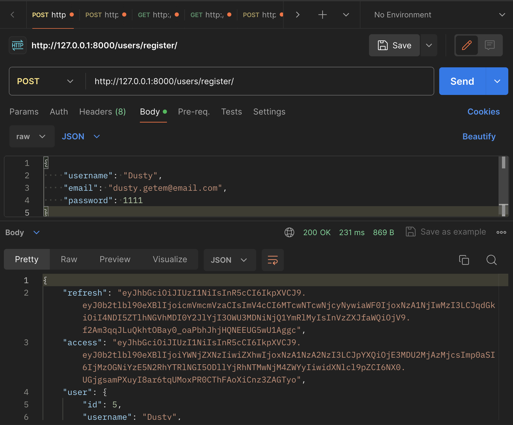
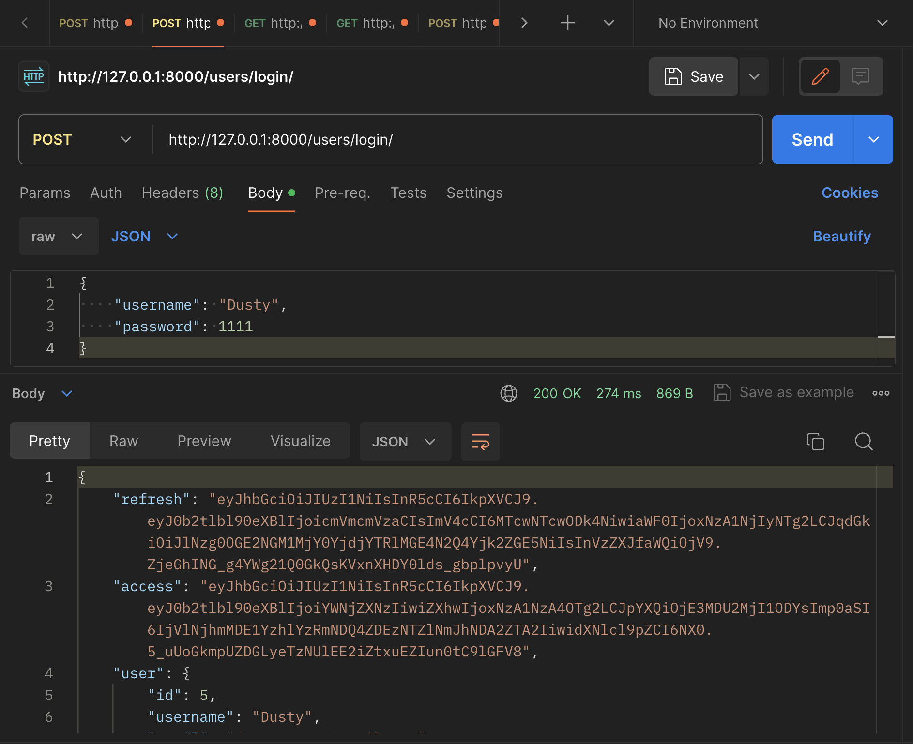
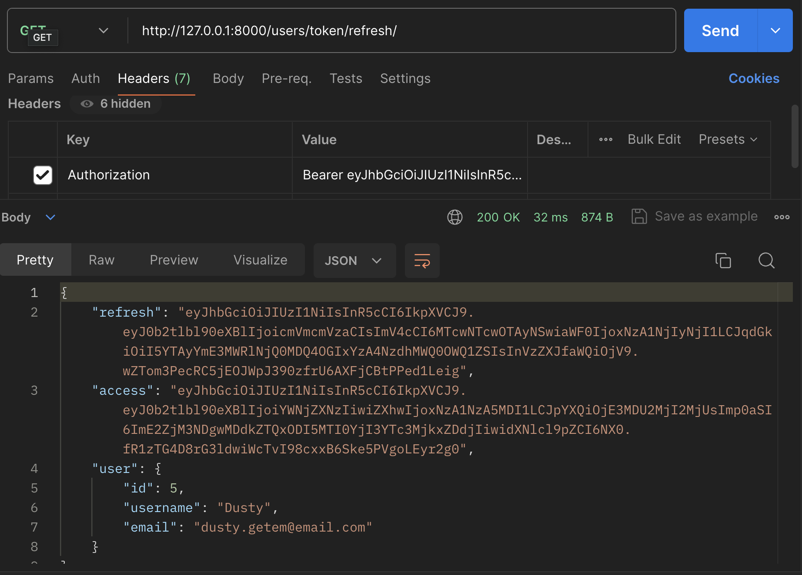
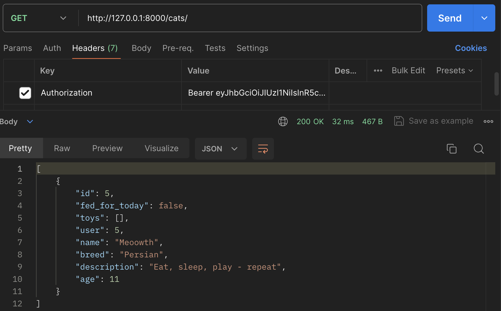
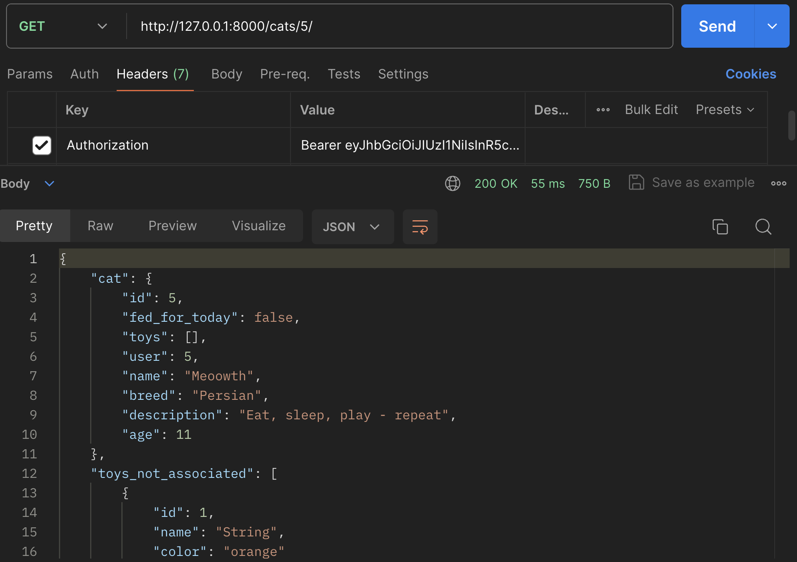
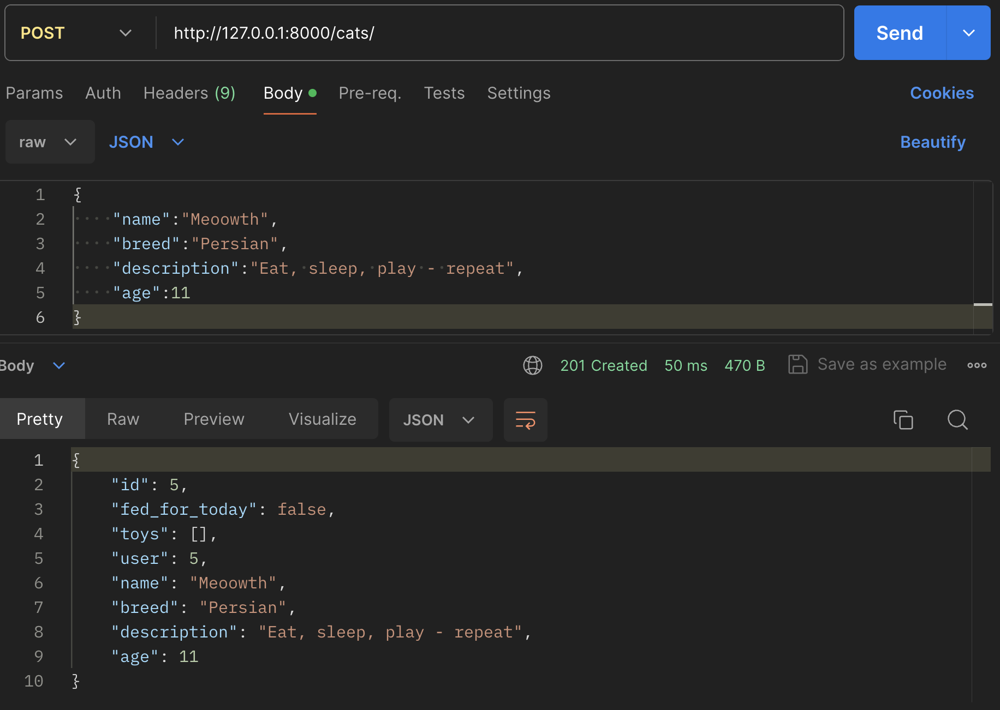
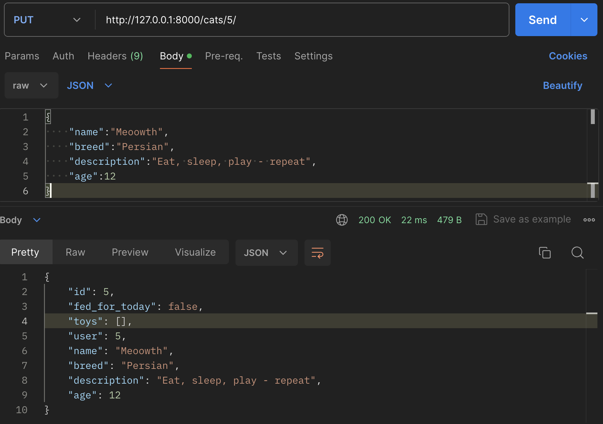
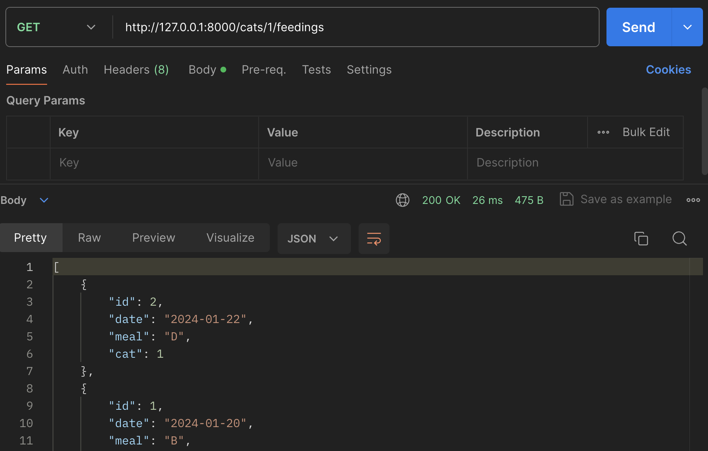
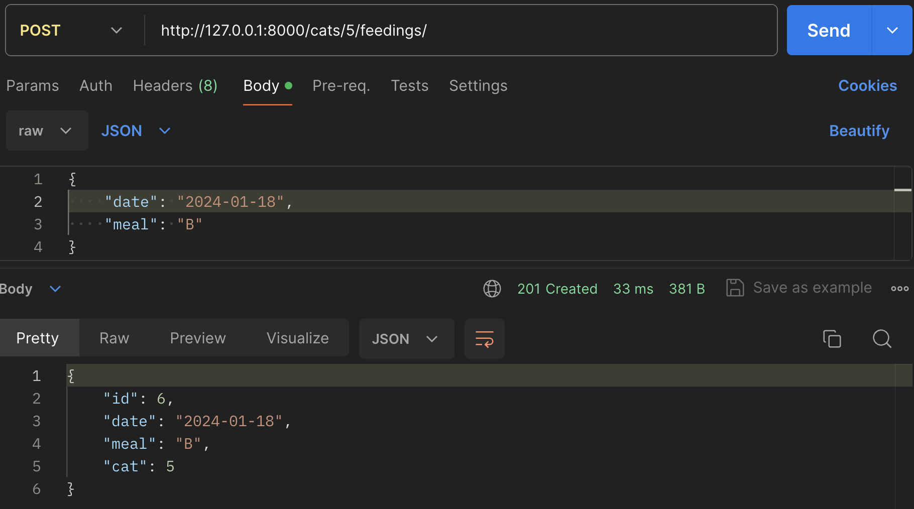
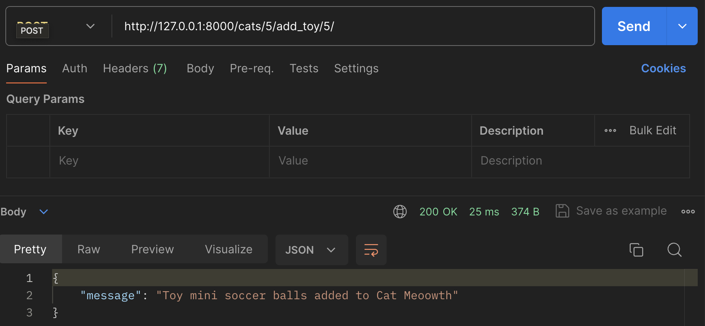

# Django CatCollector: Final Code

Welcome to the repository containing the comprehensive code for our Django-based Cat Collector RESTful API, featuring JWT Authentication. This project stands as a testament to the versatility and robustness of Django. Throughout the development process, you've gained substantial insights into Django's capabilities and best practices. The journey from conceptualizing the Database Entity-Relationship Diagram (ERD) to meticulously crafting each functional component underscores the importance of strategic planning and methodical execution in software development. Be sure to check out a front-end build that complements this Django API [here](https://git.generalassemb.ly/SEB-Base-Curriculum/catcollector-frontend).

In this documentation, we provide illustrative examples of interacting with our Cat Collector Django API. While the primary interaction with our API might be through a browser or a frontend framework such as React, we emphasize the utility of Postman for testing and debugging. Employing Postman for setting up and executing API calls offers several advantages:

1. **Precision in Debugging**: With Postman, you can meticulously inspect each request and response, ensuring that you pinpoint the precise location of issues - whether in the backend or frontend.

2. **Streamlined Testing**: Postman simplifies the process of testing your API endpoints, allowing you to send various types of requests, manipulate headers, and scrutinize the responses, all within a user-friendly interface.

3. **Documentation and Collaboration**: Postman facilitates the documentation of your API, making it easier for team members to understand and collaborate on the project. The ability to share collections and environments ensures that everyone is on the same page.

As you delve into the examples below, remember that the walkthrough you have completed are not just instructions but tools that equip you with the understanding and skills to troubleshoot, optimize, and scale your Django application.

Let's remind ourselves of the url patterns that will help us craft our API requests:

```python
urlpatterns = [
  path('', Home.as_view(), name='home'),
  path('users/register/', CreateUserView.as_view(), name='register'),
  path('users/login/', LoginView.as_view(), name='login'),
  path('users/token/refresh/', VerifyUserView.as_view(), name='token_refresh'),
  path('cats/', CatList.as_view(), name='cat-list'),
  path('cats/<int:id>/', CatDetail.as_view(), name='cat-detail'),
  path('cats/<int:cat_id>/feedings/', FeedingListCreate.as_view(), name='feeding-list-create'),
  path('cats/<int:cat_id>/feedings/<int:id>/', FeedingDetail.as_view(), name='feeding-detail'),
  path('toys/', ToyList.as_view(), name='toy-list'),
  path('toys/<int:id>/', ToyDetail.as_view(), name='toy-detail'),
  path('cats/<int:cat_id>/add_toy/<int:toy_id>/', AddToyToCat.as_view(), name='add-toy-to-cat'),
  path('cats/<int:cat_id>/remove_toy/<int:toy_id>/', RemoveToyFromCat.as_view(), name='remove-toy-from-cat'),
]
```

Below are a series of screenshots that will help us with testing the routes above.

A few important considerations before getting started:

- **Request Format**: Verify that the request body is structured as JSON. This ensures that the API correctly interprets and processes the incoming data.
- **Protected Routes**: Be aware that some routes are shielded and necessitate the inclusion of a valid Authentication header. This header should carry the appropriate token to authenticate and authorize the request.

### User Authentication Routes

Our application's functionality hinges significantly on user-based operations. Consequently, understanding and effectively utilizing the user authentication routes is paramount. Below, we detail the necessary steps to interact with these routes, beginning with user registration.

#### User Registration
- HTTP Method: POST
- Endpoint: /users/register/
- Request Body Requirements:
  - username
  - email
  - password



#### User Login

- HTTP Method: POST
- Endpoint: /users/login/
- Request Body Requirements:
  - username
  - password



#### User Verification

- HTTP Method: GET
- Endpoint: /users/token/refresh/
- Authorization header with active access token required 



### Cat Routes

Our cat routes follow a pretty standard setup - however, each cat route is protected and requires an access token.

#### Cat Index

- HTTP Method: GET
- Endpoint: /cats/
- Authorization header with active access token required



#### Cat Detail

- HTTP Method: GET
- Endpoint: /cats/1/
- Authorization header with active access token required



#### Cat Create

- HTTP Method: POST
- Endpoint: /cats/
- Authorization header with active access token required
- Request Body Requirements:
  - name
  - breed
  - description
  - age



#### Cat Update

- HTTP Method: PUT
- Endpoint: /cats/1/
- Authorization header with active access token required
- Request Body Requirements:
  - name
  - breed
  - description
  - age



#### Cat Delete

- HTTP Method: DELETE
- Endpoint: /cats/1/
- Authorization header with active access token required


### Feeding Routes
For feedings, we will focus on the two most important routes - listing all feedings for a specific cat and creating a feeding associated with a cat.

#### All Cat Feedings

- HTTP Method: GET
- Endpoint: /cats/1/feedings/



#### Add Cat Feeding

- HTTP Method: POST
- Endpoint: /cats/1/feedings/
- Request Body Requirements:
  - date
  - meal



### Toy Routes

Altough there are several toy routes, we will skip the basic CRUD routes and display adding a toy to a cat.

#### Add Toy to Cat

- HTTP Method: POST
- Endpoint: /cats/1/add_toy/5/



Please note, removing a toy is also a POST request.
